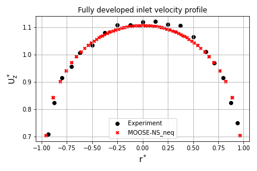

This is the documentation for ERCOFTAC CASE 004: swirling curved pipe

It includes a postprocessing Jupyter notebook, the input file used and the csv files. In addition to the experiment, the results were contrasted against Star-CCM+ results.

