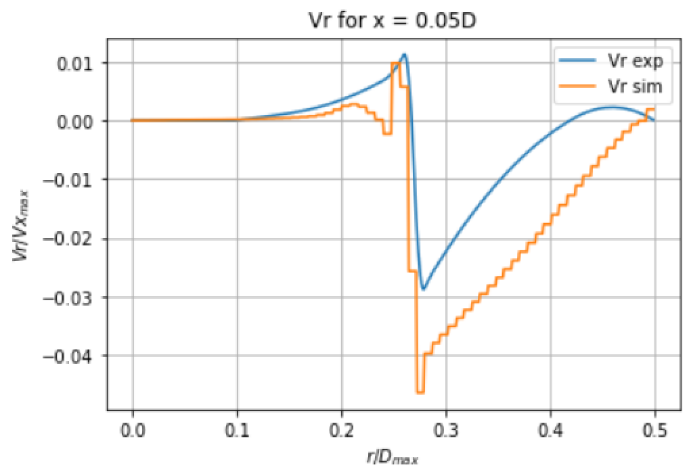
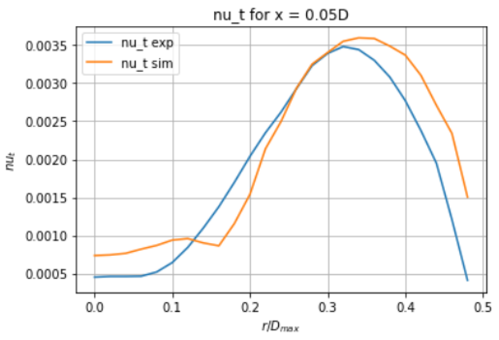

This is the documentation for ERCOFTAC CASE 13: sudden expansion pipe

It includes the script used, the input files for this script and the results. All results have been renormalized by the bulk inlet speed. The recirculation (Vx > 0 for small values of x and r close to D) doesn't occur because the solution tends to be overdiffusive.

[alt text](velxX0.05D.png)

