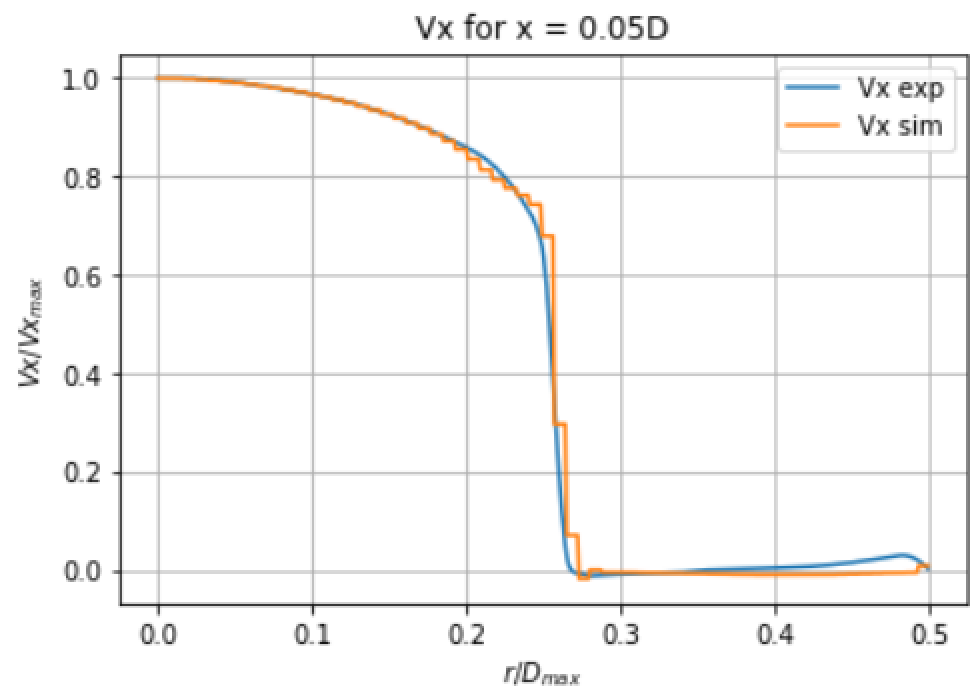

This is the documentation for ERCOFTAC CASE 13: sudden expansion pipe

It includes the script used, the input files for this script and the results. All results have been renormalized by the bulk inlet speed!

[alt text](nutX0.05D.png)

