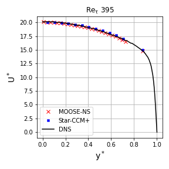
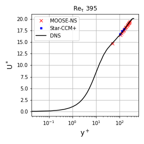
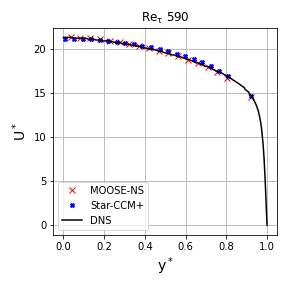
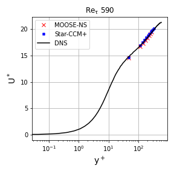

This is the documentation for ERCOFTAC CASE 32: channel flow

It includes the script used for both friction Reynolds numbers, the input files for this script and the results. A Jupyter notebook is included where the postprocessing is carried out. In addition to the DNS results, Star-CCM+ results using the same model are presented.

